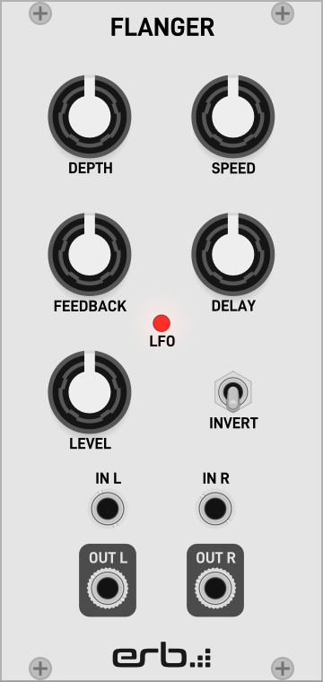
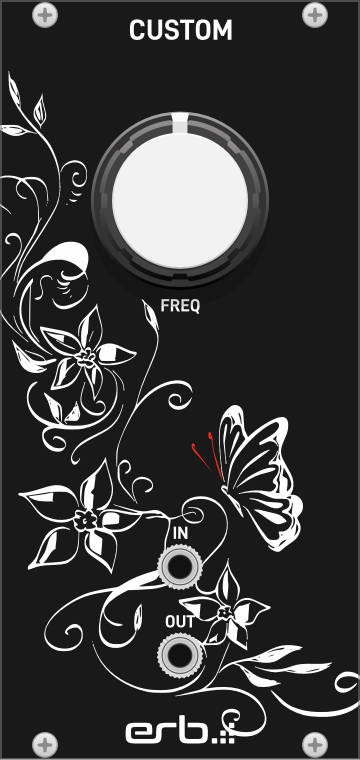
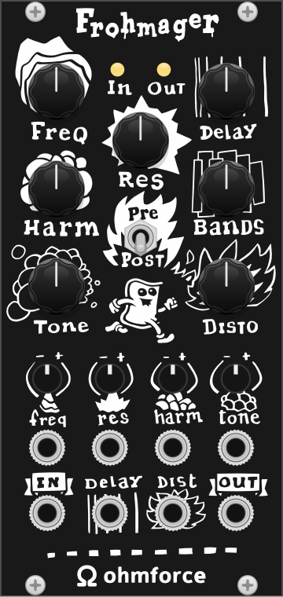
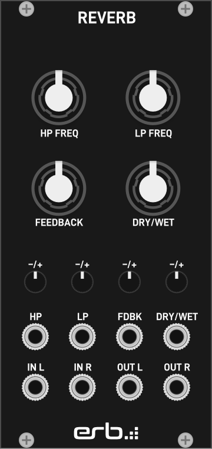

# eurorack-blocks

[](https://creativecommons.org/licenses/by-sa/4.0/)
[<!--lint ignore no-dead-urls-->](https://github.com/ohmtech-rdi/eurorack-blocks/actions?workflow=Ubuntu%2020.04)
[<!--lint ignore no-dead-urls-->](https://github.com/ohmtech-rdi/eurorack-blocks/actions?workflow=macOS%2011)
[<!--lint ignore no-dead-urls-->](https://github.com/ohmtech-rdi/eurorack-blocks/actions?workflow=Windows%202019)
[](https://eurorack-blocks.readthedocs.io/en/latest/?badge=latest)


The `eurorack-blocks` project allows to develop your own custom Eurorack module for either
prototyping or fun in the comfort of your day-to-day IDE with the C++ or Faust language,
or using the Cycling '74 Max environment,
testing and debugging in a [virtual Eurorack environment](https://vcvrack.com),
and when ready, to auto-magically generate all the needed files to manufacture
the eurorack module for you to use in a real Eurorack modular system.

`eurorack-blocks` is using [`Daisy Patch Submodule`](https://www.electro-smith.com/daisy/patch-sm),
a DSP platform for Eurorack synthesizer modules. It features a lightning fast STM32 processor,
high fidelity stereo audio codec, and enough RAM for 10 minute long buffers
— all with standard signal levels and conditioning for the Eurorack ecosystem.

The [documentation as well as the Getting Started guide can be found on **Read the Docs**](https://eurorack-blocks.readthedocs.io/en/latest/).

The full project's manifest can be read [here](manifest.md).


```cpp
// Bypass.h

#include "artifacts/BypassUi.h"

struct Bypass {
   BypassUi ui;

   void process () {
      ui.audio_out = ui.audio_in;
   }
};
```


```erb
// Bypass.erbui

module Bypass {
   width 8hp
   material aluminum black
   header { label "BYPASS" }

   control audio_in AudioIn {
      position 4hp, 40mm
      label "IN"
   }

   control audio_out AudioOut {
      position 4hp, 80mm
      label "OUT"
   }
}
```

```console
raf:bypass$ erbb configure 👈 Generate IDE projects
raf:bypass$ ls -l artifacts/
drwxr-xr-x  7 raf  staff  224 Feb  9 18:31 actions
drwxr-xr-x  3 raf  staff   96 Feb  9 18:31 daisy 👈 Daisy firmware build files
drwxr-xr-x  3 raf  staff   96 Feb  9 18:31 simulator 👈 Simulator build files
-rw-r--r--  1 raf  staff  109 Feb  9 18:31 Bypass.code-workspace 👈 Visual Studio Code Workspace
drwxr-xr-x  3 raf  staff   96 Feb  9 18:31 project_vcvrack.xcodeproj 👈 Simulator Xcode Project
raf:bypass$ erbb build simulator 👈 Build the simulator for VCV Rack
...
** BUILD SUCCEEDED **
raf:bypass$ open /Applications/Rack.app 👈 Test in VCV Rack and iterate
raf:bypass$ erbb build hardware 👈 Build the hardware files for manufacturing
raf:bypass$ ls -l artifacts/hardware/
-rw-r--r--   1 raf  staff     387 Feb  9 18:31 Bypass.bom.csv 👈 Bill of materials
-rw-r--r--   1 raf  staff   15696 Feb  9 18:31 Bypass.dxf 👈 Aluminum panel milling/drilling
-rw-r--r--   1 raf  staff   32731 Feb  9 18:31 Bypass.gerber.zip 👈 PCB Gerber files
-rw-r--r--   1 raf  staff  116908 Feb  9 18:31 Bypass.kicad_pcb
-rw-r--r--   1 raf  staff    4754 Feb  9 18:31 Bypass.pdf 👈 Aluminum panel UV printing
drwxr-xr-x  12 raf  staff     384 Feb  9 18:31 gerber
raf:bypass$ erbb build 👈 Build the firmware
ninja: Entering directory `.../eurorack-blocks/samples/bypass/artifacts/daisy/out/Release'
[191/191] LINK Bypass
OBJCOPY Bypass
raf:bypass$ erbb install 👈 Upload the firmware
Enter the system bootloader by holding the BOOT button down,
and then pressing, and releasing the RESET button.
Press Enter to continue...
...
raf:bypass$
```


## Sample Projects

<p align="center">
<a href="./samples/bypass/"></a>
<a href="./samples/faust/"></a>
<a href="./samples/drop/"></a>
<a href="./samples/reverb/"></a>
<a href="./samples/kick/"></a>
<a href="./samples/custom/"></a>
<a href="./samples/frohmager/"></a>
</p>

Before reading sample code, make sure to grasp the concepts in the [documentation](https://eurorack-blocks.readthedocs.io/en/latest/).
Sample projects are a good place to continue learning:

- [`bypass`](./samples/bypass/) is the example used above,
- [`drop`](./samples/drop/) shows the usage of almost every blocks,
- [`reverb`](./samples/reverb/) illustrates how to utilize all the platform memory,
- [`kick`](./samples/kick/) illustrates how to use factory samples and make big programs,
- [`faust`](./samples/faust/) describes how to use the Faust functional programming language,
- [`custom`](./samples/custom/) illustrates how to use custom silkscreens, boards and manufacturers,
- [`frohmager`](./samples/frohmager/) is the recreation in hardware form factor of the legendary Ohm Force multi-band resonant filter (closed-source).


## Cycling '74 Max Patches

[](./max/reverb/)

First make sure to read the [Max integration documentation](https://eurorack-blocks.readthedocs.io/en/latest/max/setup.html).
Sample projects are a good place to continue learning:

- [`reverb`](./max/reverb/) uses Gigaverb.
- [`drop`](./max/drop/) shows the usage of almost every blocks.


## Setting up

Setting up the development environment is described in the
[documentation](https://eurorack-blocks.readthedocs.io/en/latest/getting-started/setup.html).
Integrations might have also their own Set up documentation, so make sure to read this as well.


## Structure

```
eurorack-blocks/
   blocks/
   boards/
   build-system/
   include/
   max/
   src/
   submodules/
```

- [`blocks`](./blocks/) contains all the atomic blocks hardware for design validation and software tests,
- [`boards`](./blocks/) contains all the boards hardware to design with,
- [`build-system`](./build-system/) contains the build system used to build and deploy
   the tests and samples,
- [`include`](./include/) contains the software implementation of the blocks,
- [`max`](./max/) contains the Cycling '74 Max integration,
- [`src`](./src/) contains the software implementation of the blocks,
- [`submodules`](./submodules/) contains the software dependencies as submodules.


## License

All files in this repository, excluding `submodules/`, are provided with the CC BY-SA 4.0 license
for the hardware part, and MIT license for the software part, **except**:

- The [Cycling '74 Max Gen DSP Source Code](./include/gen_dsp),
- The [D-DIN Font](./include/erb/vcvrack/design/d-din),
   under [SIL Open Font License](./include/erb/vcvrack/design/d-din/SIL%20Open%20Font%20License.txt),
- The [Indie Flower Font](./include/erb/vcvrack/design/indie-flower),
   under [SIL Open Font License](./include/erb/vcvrack/design/indie-flower/OFL.txt),
- The [Arpeggio project](https://github.com/textX/Arpeggio), under the [MIT License](https://textx.github.io/Arpeggio/stable/about/license/),
- The [Custom panel artwork](https://svgsilh.com/image/1532531.html), under the [Creative Commons CC0 License](https://creativecommons.org/publicdomain/zero/1.0/).
- The Ohm Force Frohmager, under its proprietary license.

Some files that get installed in `build-system/toolchain` during `erbb setup` are not part of this repository, but redistributed during the installation phase,
with the following licenses:
   - [dfu-util](https://dfu-util.sourceforge.net) under the [GPL version 2](https://sourceforge.net/p/dfu-util/dfu-util/ci/master/tree/COPYING),
   - [Cairo](https://www.cairographics.org) under the [GNU Lesser General Public License (LGPL) version 2.1 or the Mozilla Public License (MPL) version 1.1](https://gitlab.freedesktop.org/cairo/cairo/-/blob/master/COPYING),
   - [libcapstone](https://github.com/libcapstone/libcapstone) under the [3-Clause BSD License](https://github.com/libcapstone/libcapstone/blob/main/LICENSE.TXT),
   - [Fontconfig](https://www.freedesktop.org/wiki/Software/fontconfig/) under the [MIT License](https://gitlab.freedesktop.org/fontconfig/fontconfig/-/blob/main/COPYING),
   - [Freetype](https://freetype.org) under the [Freetype license or  GNU General Public License (GPL), version 2](https://freetype.org/license.html),
   - [libftdi](https://www.intra2net.com/en/developer/libftdi/), which [library is licensed under LGPL 2.1 (not any later)](http://developer.intra2net.com/git/?p=libftdi;a=blob;f=COPYING.LIB;h=5bc8fb2c8f757e34a0d8f4644f589d57609e213f;hb=HEAD), and [EEPROM programmer is licensed under GPL 2 (not any later)](http://developer.intra2net.com/git/?p=libftdi;a=blob;f=COPYING.GPL;h=d511905c1647a1e311e8b20d5930a37a9c2531cd;hb=HEAD),
   - [libhidapi](https://github.com/libusb/hidapi), under the [GNU General Public License, version 3.0](https://github.com/libusb/hidapi/blob/master/LICENSE-gpl3.txt), [BSD-Style License](https://github.com/libusb/hidapi/blob/master/LICENSE-bsd.txt) or [more liberal original HIDAPI license](https://github.com/libusb/hidapi/blob/master/LICENSE-orig.txt),
   - [libpixman](https://github.com/libpixman/pixman) under the [MIT license](https://github.com/libpixman/pixman/blob/master/COPYING),
   - [libpng](http://www.libpng.org/pub/png/libpng.html) under the [PNG Reference Library License version 2](http://www.libpng.org/pub/png/src/libpng-LICENSE.txt),
   - [libusb](https://github.com/libusb/libusb) under the [GNU Lesser General Public License v2.1](https://github.com/libusb/libusb/blob/master/COPYING),
   - [Xorg libraries](https://gitlab.freedesktop.org/xorg/lib) under the [MIT license](https://gitlab.freedesktop.org/xorg/lib/libx11/-/blob/master/COPYING),
   - [openocd](https://openocd.org) under the [GPL-2.0-or-later](https://sourceforge.net/p/openocd/code/ci/master/tree/COPYING)
   - [GNU Arm Embedded Toolchain](https://developer.arm.com/downloads/-/gnu-rm) under various licenses, navigate to `build-system/toolchain/gcc-arm-none-eabi-10.3-2021.10/share/doc/gcc-arm-none-eabi/license.txt` for a complete list,
   - [KiCad](https://www.kicad.org) under its [license](https://gitlab.com/kicad/code/kicad/-/blob/master/LICENSE).

Redistribution of your firmware for commecial purposes only have a subset of those licences:
- Modules which firmware was code generated by Gen from a patcher is dual licensed under the [Cycling '74 License for Max-Generated Code for Export](https://support.cycling74.com/hc/en-us/articles/10730031661587) or [GPLv3](https://www.gnu.org/licenses/gpl-3.0.en.html). 
- Eurorack-blocks framework is under the MIT license,
- [libDaisy](https://github.com/electro-smith/libDaisy) is under the [MIT license](https://github.com/electro-smith/libDaisy/blob/master/LICENSE),
- [GNU Arm Embedded Toolchain libraries](https://developer.arm.com/downloads/-/gnu-rm) under various licenses, navigate to `build-system/toolchain/gcc-arm-none-eabi-10.3-2021.10/share/doc/gcc-arm-none-eabi/license.txt` for a complete list.

Redistribution of your panel, if using the font in this repository:
- The [D-DIN Font](./include/erb/vcvrack/design/d-din), under [SIL Open Font License](./include/erb/vcvrack/design/d-din/SIL%20Open%20Font%20License.txt),

To fullfil attribution, users will generally put the ERB logo and the URL to this project, on their PCB like in [this example](https://blogger.googleusercontent.com/img/b/R29vZ2xl/AVvXsEjbp3qvEp6JkepX6Xh4_h2b57rY708SmwVZjv8ANe1bIvhrfsvV8bGgZkJezpeA5sWZmZln5WsoP8231fTwboIVxd3dbACfYKJyjOHhfvMlSTO7WLXSDi_nQDXI3Ygvw2XLOCR4dY4M1gGWNpXnzImI5TEGjqsB7BOLt36qAzrYm9yt0QguTqL6EOvM/s4032/TopographeBack.jpeg) (courtesy of [Oms in serial](https://omsinserial.blogspot.com))
