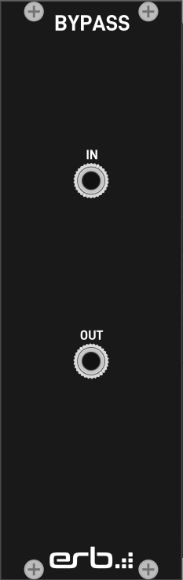
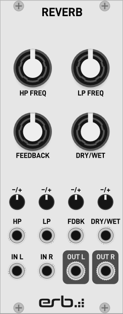
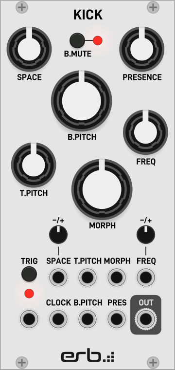

# eurorack-blocks

[](https://creativecommons.org/licenses/by-sa/4.0/)
[<!--lint ignore no-dead-urls-->](https://github.com/ohmtech-rdi/eurorack-blocks/actions?workflow=Ubuntu%2020.04)
[<!--lint ignore no-dead-urls-->](https://github.com/ohmtech-rdi/eurorack-blocks/actions?workflow=macOS%2010.15)
[](https://eurorack-blocks.readthedocs.io/en/latest/?badge=latest)


The `eurorack-blocks` project allows to develop your own custom Eurorack module for either
prototyping or fun in the comfort of your day-to-day IDE and debugging in a
[virtual Eurorack environment](https://vcvrack.com),
and when ready, to auto-magically generate all the needed files to manufacture
the eurorack module for you to use in a real Eurorack modular system.

`eurorack-blocks` is using [`Daisy Patch Submodule`](https://www.electro-smith.com/daisy/patch-sm),
a DSP platform for Eurorack synthesizer modules. It features a lightning fast STM32 processor,
high fidelity stereo audio codec, and enough RAM for 10 minute long buffers
— all with standard signal levels and conditioning for the Eurorack ecosystem.

The [documentation as well as the Getting Started guide can be found on **Read the Docs**](https://eurorack-blocks.readthedocs.io/en/latest/).

The full project's manifest can be read [here](manifest.md).


```cpp
// Bypass.h

#include "artifacts/BypassUi.h"

struct Bypass {
   BypassUi ui;

   void process () {
      ui.audio_out = ui.audio_in;
   }
};
```



```erb
// Bypass.erbui

module Bypass {
   width 8hp
   material aluminum black
   header { label "BYPASS" }

   control audio_in AudioIn {
      position 4hp, 40mm
      style thonk.pj398sm.knurled
      label "IN"
   }

   control audio_out AudioOut {
      position 4hp, 80mm
      style thonk.pj398sm.knurled
      label "OUT"
   }
}
```

```console
raf:bypass$ erbb configure 👈 Generate IDE project and hardware files
raf:bypass$ ls artifacts/
...
drwxr-xr-x  4 raf  staff    128 Apr 23 18:14 project_vcvrack.xcodeproj 👈 Xcode Project
...
raf:bypass$ erbb build 👈 Build the firmware
ninja: Entering directory `.../eurorack-blocks/samples/bypass/artifacts/out/Release'
[185/185] LINK bypass-daisy
OBJCOPY bypass-daisy
raf:bypass$ erbb install dfu 👈 Upload the firmware
Enter the system bootloader by holding the BOOT button down,
and then pressing, and releasing the RESET button.
Press Enter to continue...
...
raf:bypass$
```


## Sample Projects

[](./samples/bypass/)
[](./samples/drop/)
[](./samples/reverb/)
[](./samples/kick/)

Before reading sample code, make sure to grasp the concepts in the [documentation](https://eurorack-blocks.readthedocs.io/en/latest/).
Sample projects are a good place to continue learning:

- [`bypass`](./samples/bypass/) is the example used above,
- [`drop`](./samples/drop/) shows the usage of almost every blocks,
- [`reverb`](./samples/reverb/) illustrates how to utilize all the platform memory,
- [`kick`](./samples/kick/) illustrates how to use factory samples and make big programs.


## Setting up

Setting up the development environment is described in the [documentation](https://eurorack-blocks.readthedocs.io/en/latest/getting-started/setup.html).


## Structure

```
eurorack-blocks/
   blocks/
   boards/
   build-system/
   include/
   src/
   submodules/
```

- [`blocks`](./blocks/) contains all the atomic blocks hardware for design validation and software tests,
- [`boards`](./blocks/) contains all the boards hardware to design with,
- [`build-system`](./build-system/) contains the build system used to build and deploy
   the tests and samples,
- [`include`](./include/) contains the software implementation of the blocks,
- [`src`](./src/) contains the software implementation of the blocks,
- [`submodules`](./submodules/) contains the software dependencies as submodules.


## License

All files in this repository, excluding `submodules/`, are provided with the CC BY-SA 4.0 license, **except**:

- The [D-DIN Font](./include/erb/vcvrack/design/d-din),
   under [SIL Open Font License](./include/erb/vcvrack/design/d-din/SIL%20Open%20Font%20License.txt),
- The [Indie Flower Font](./include/erb/vcvrack/design/indie-flower),
   under [SIL Open Font License](./include/erb/vcvrack/design/indie-flower/OFL.txt),
- The [Arpeggio project](https://github.com/textX/Arpeggio), under the [MIT License](https://textx.github.io/Arpeggio/stable/about/license/).
