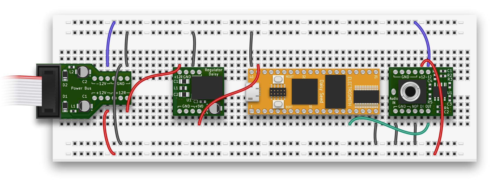

# audio-in-daisy

## Description

This block is a simple analog audio input for the
[Daisy Seed](https://www.electro-smith.com/daisy/daisy) onboard codec.
Its design is detailed [here](./documentation/design.md).


## Connecting

<p align="center"></p>

- This block needs its `GND` to be connected to the ground. All `GND` pins are connected
   internally,
- This block needs its `-12` to be connected to the `-12V` of the `power-bus`,
- This block needs its `+12` to be connected to the `+12V` of the `power-bus`,
- The `NOP` pin can be either connected to:
   - `GND` to send (slightly noisy) zeros to the software implementation,
   - Cascading the `DI` signal from another `audio-in-daisy` block,
   - A pseudo-random predefined signal to detect a jack connection
      as explained on the Mutable Instruments forums
      [here](https://forum.mutable-instruments.net/t/plaits-normalization-probe/14358/2)
      and implemented
      [here](https://github.com/pichenettes/eurorack/blob/master/plaits/ui.cc#L368).
- The signal `OUT` is the audio input signal. It should be connected to either Pin 16 or Pin 17.
   See [Daisy Seed pinout](https://images.squarespace-cdn.com/content/v1/58d03fdc1b10e3bf442567b8/1591827747342-HCXMM2NNR26SP5F4U2CJ/ke17ZwdGBToddI8pDm48kN5PbQBGNYbW-5Hm1pf8hRF7gQa3H78H3Y0txjaiv_0fDoOvxcdMmMKkDsyUqMSsMWxHk725yiiHCCLfrh8O1z4YTzHvnKhyp6Da-NYroOW3ZGjoBKy3azqku80C789l0kLp48N9LluBiCpBrPZntaz462IffsVrAff3VJkwKncM1HZuDnV98dfxM9yHlqFkUQ/DaisyPinoutRev4%404x.png?format=500w) for details.

If only one audio input is connected, the other unused pin should be connected to `GND`.

The `DI` pin is the signal coming out directly from the jack connector and should be left floating
if not used.

The pseudo-random predefined signal jack detection method allows,
from a user experience point of view, to dissociate a non-connected
jack from a connected jack at `GND` level.


## Using

```c++
int main ()
{
   using namespace erb;
   
   Module module;
   AudioInDaisy audio_in_left (module, AudioInDaisyPinLeft);   // 1.
   AudioInDaisy audio_in_right (module, AudioInDaisyPinRight); // 2.

   module.run ([&](){
      for (size_t i = 0 ; i < audio_in_left.size () ; ++i)     // 3.
      {
         float left  = audio_in_left [i];                      // 4.
         float right = audio_in_right [i];                     // 5.
      }
   });
}
```

1. Attach the audio input to the module with the onboard codec left pin (Pin 16),
2. Attach the audio input to the module with the onboard codec right pin (Pin 17),
2. Loop through all the samples in the buffer. `erb::buffer_size` can be used instead,
3. Retrieve the audio input value on codec left pin,
4. Retrieve the audio input value on codec right pin.

The `AudioInDaisy` class reference is available [here](./documentation/reference.md).
