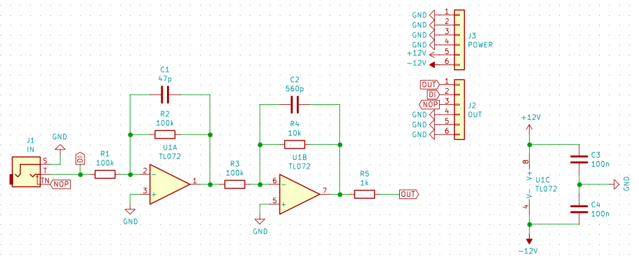

# Design

This design is adapted from the
[Daisy Patch schematics](https://github.com/electro-smith/Hardware/blob/master/reference/daisy_patch/ES_Daisy_Patch_Rev4.pdf).

## Schematic

### Overview

This block provides a standard eurorack jack connector that is used for eurorack analog
audio input signals.
it is designed to take a ±12V range to cover every possible cases.

The block is an input active amplifier and low-pass filter that adapts to the
[AK4556 onboard codec design](https://www.akm.com/content/dam/documents/products/audio/audio-codec/ak4556vt/ak4556vt-en-datasheet.pdf).

### Input

The input is a jack connector `J1`. When the jack connector is not connected, the signal
from `NOP` is the input.

The direct output `DI` allows to cascade the non-amplified and filtered signal to another
`audio-in-daisy` block.

### First Stage Op-amp

Since the `U1` input 2 is a virtual ground, the input has a standard 100kΩ impedance.

The Op-amp part `U1A` configuration is an inverting low-pass filter.

#### Op-amp Gain

The input signal is amplified by:

Note the gain minus sign which shifts the audio signal phase by 180°.

When powered with ±12 supply ramp, the [TL072](https://www.ti.com/lit/ds/symlink/tl072.pdf)
ensures almost linear amplification for a ±5V input signal, as its common-mode voltage range
VCM is –12V + 4V = –8V to 12V, as described in the datasheet
on page 11 Section 6.6.

#### Op-amp Low-pass Filter

The `R2` and `C1` components make a low-pass filter, with a frequency cutoff at:

### Second Stage Op-amp

The Op-amp part `U1B` configuration is an inverting low-pass filter.

#### Op-amp Gain

The input signal is amplified by:

Note the gain minus sign which shifts the audio signal phase by 180°.

But because the previous stage was already shifting phase by 180°, there is no total phase shift.

#### Op-amp Low-pass Filter

The `R4` and `C2` components make a low-pass filter, with a frequency cutoff at:

### Codec Input

`R5` acts as a current limiting resistor to protect the codec audio input.

The operating input level is 0.7 × 3.3V = 2.31V as described in the
[AK4556 codec datasheet](https://www.akm.com/content/dam/documents/products/audio/audio-codec/ak4556vt/ak4556vt-en-datasheet.pdf)
on page 2.

The normal [range of audio signal](http://www.doepfer.de/a100_man/a100t_e.htm) is 10Vpp.
With the 0.1 gain, this gives 10V × 0.1 = 1V which fits the codec input level without any clipping.

For the worst case scenario, a 24Vpp signal, with the 0.1 gain, this gives 24V × 0.1 = 2.4V
which will make the codec clip, but is still inside the 3.9V absolute maximum ratings as
described on page 6, and not even accounting for the TL072 saturation that would occur
at those input levels.

### Codec Sampling & Aliasing

The delta-sigma sampling frequency is 128fs at fs = 48kHz as seen in the
[AK4556 codec datasheet](https://www.akm.com/content/dam/documents/products/audio/audio-codec/ak4556vt/ak4556vt-en-datasheet.pdf)
on page 20.

This gives the delta-sigma sampling rate:

Considering 24kHz bandwitdh signals, the frequency range we want to preserve from aliasing
occurs in the 6MHz ± 24kHz range.

The transfer function, for the gain part is:

> [Filter analysis](./filter-analysis/) made with ngspice in Kicad
> using [Texas Instruments TL072 PSpice model](https://www.ti.com/product/TL072).

This gives a relative attenutation of 100dB - 20dB = 80dB at 6MHz.

The minimum A-weighed signal to noise ratio is 95dB as described on page 7 of the datasheet.

When condering spectral-rich audio signals such as a square or sawtooth wave, their harmonic
decay follow a 1/f progression.

The 15dB difference between the filter 80dB attenuation and 95dB S/N correspond to
0.178 in linear gain, which inverse is around 5.6. Therefore about 6 harmonics can be preserved
for a sawtooth signal with a fundamental frequency at 1MHz.

### Codec System Design

The daisy seed board has already a 10µF capacitor at the codec input as recommended by the
[AK4556 codec datasheet system design](https://www.akm.com/content/dam/documents/products/audio/audio-codec/ak4556vt/ak4556vt-en-datasheet.pdf)
in Figure 10, page 19.

### Op-amp Bypass & Bulk Capacitor

The capacitors `C3` and `C4` are 100nF bypass capacitors as recommended on page 43 of the datasheet.

The 22µF bulk capacitors are provided by the `power-bus` block.
Theirs values are way above the minimum recommended 1µF, and is shared between blocks.

## PCB Layout

 

> Gerber renders made with [tracespace view](https://tracespace.io/view/).

The bypass capacitors `C3` and `C4` are placed 1mm from `U1`
as close as possible to the power supplies as recommended by the
[TL072 datasheet](https://www.ti.com/lit/ds/symlink/tl072.pdf)
on page 43.

## BOM

### Maximum Resistors Power

| Reference | Value | Power |
| - | - | - |
| `R1` | 100kΩ | 100mW |
| `R2` | 100kΩ |  100mW |
| `R3` | 100kΩ |  100mW |
| `R4` | 10kΩ |  100mW |
| `R5` | 1kΩ |  100mW |

#### `R1`, `R2` & `R3`

The maximum power of `R1` and `R2`, with the absolute 12V eurorack limit is:

Which is way below its rated 100mW.

#### `R4`

The maximum power of `R4`, with its maximum 1.2V output is:

Which is way below its rated 100mW.

### Maximum Capacitors Rated Voltage

| Reference | Value | Rated Voltage |
| - | - | - |
| `C1` | 47pF | 25V |
| `C2` | 560pF | 50V |
| `C3` | 100nF |  25V |
| `C4` | 100nF |  25V |

#### `C1`

`C1` sees at most 12V, which is below half of its 25V rated voltage.

#### `C2`

`C2` sees at most 1V, which is far below half of its 50V rated voltage.

#### `C3` & `C4`

`C3` & `C4` see 12V, which is below half of its 25V rated voltage.

### Worst Case Tolerance Deviation Impact

#### Gain Stage

| Reference | Value | Tolerance |
| - | - | - |
| `R1` | 100kΩ | 1% |
| `R2` | 100kΩ |  1% |
| `R3` | 100kΩ |  1% |
| `R4` | 10kΩ |  1% |

Worst minimum case:

Worst maximum case:

Both cases are in acceptable limits.

#### First Stage Low-pass Filter

| Reference | Value | Tolerance |
| - | - | - |
| `R2` | 100kΩ | 1% |
| `C1` | 47pF | 5% |

Worst minimum case:

Worst maximum case:

Both cases are in acceptable limits.

#### Second Stage Low-pass Filter

| Reference | Value | Tolerance |
| - | - | - |
| `R4` | 10kΩ | 1% |
| `C2` | 560pF | 5% |

Worst minimum case:

Worst maximum case:

Both cases are in acceptable limits.

## Generating Production Files

The gerber files and the BOM in `csv` format can be produced by running the block `build.py`
script. It requires to be launched with the Python KiCad bundled executable.
The files are generated in the `artifacts` block directory.

When using macOS and KiCad is installed in the usual `/Applications` directory, the
`build.py` script can be runned directly from the shell, as the shebang line will automatically
select the right version of Python to run.

> Math formulas made with [Masaki AOTA's Tex image link generator](https://tex-image-link-generator.herokuapp.com).
