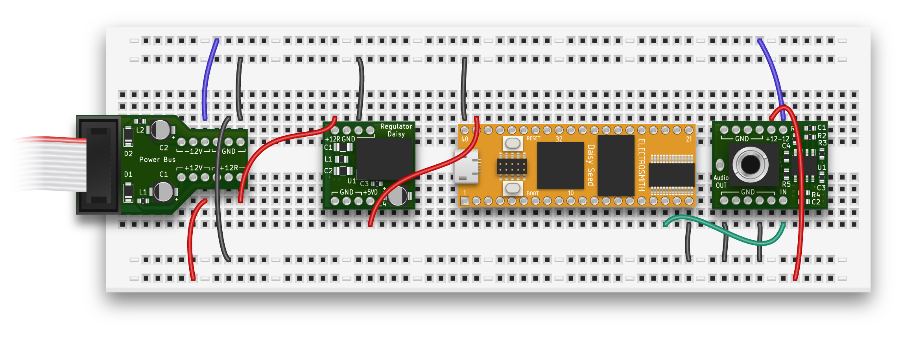

# audio-out-daisy

## Description

This block is a simple analog audio output for the
[Daisy Seed](https://www.electro-smith.com/daisy/daisy) onboard codec.
Its design is detailed [here](./documentation/design.md).


## Connecting

<p align="center"></p>

- This block needs its `GND` to be connected to the ground. All `GND` pins are connected
   internally,
- This block needs its `-12` to be connected to the `-12V` of the `power-bus`,
- This block needs its `+12` to be connected to the `+12V` of the `power-bus`,
- The signal `IN` is the audio output signal. It should be connected to either Pin 18 or Pin 19.
   See [Daisy Seed pinout](https://images.squarespace-cdn.com/content/v1/58d03fdc1b10e3bf442567b8/1591827747342-HCXMM2NNR26SP5F4U2CJ/ke17ZwdGBToddI8pDm48kN5PbQBGNYbW-5Hm1pf8hRF7gQa3H78H3Y0txjaiv_0fDoOvxcdMmMKkDsyUqMSsMWxHk725yiiHCCLfrh8O1z4YTzHvnKhyp6Da-NYroOW3ZGjoBKy3azqku80C789l0kLp48N9LluBiCpBrPZntaz462IffsVrAff3VJkwKncM1HZuDnV98dfxM9yHlqFkUQ/DaisyPinoutRev4%404x.png?format=500w) for details.


## Using

```c++
int main ()
{
   using namespace erb;

   Module module;
   AudioOutDaisy audio_out_left (module, AudioOutDaisyPinLeft);   // 1.
   AudioOutDaisy audio_out_right (module, AudioOutDaisyPinRight); // 2.
   
   module.run ([&](){                                             // 3.
      for (size_t i = 0 ; i < audio_out_left.size () ; ++i)
      {
         audio_out_left [i] = ...;                                // 4.
         audio_out_right [i] = ...;                               // 5.
      }
   });
}
```

1. Attach the audio output to the module with the onboard codec left pin (Pin 18),
2. Attach the audio output to the module with the onboard codec right pin (Pin 19),
2. Loop through all the samples in the buffer. `erb::buffer_size` can be used instead,
3. Set the audio output value on codec left pin,
4. Set the audio output value on codec right pin.

The `AudioOutDaisy` class reference is available [here](./documentation/reference.md).
