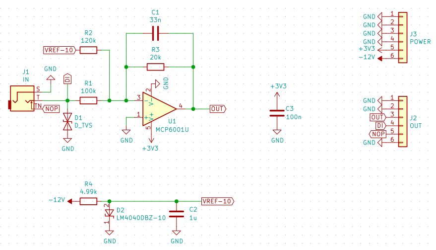

# Design

This design is adapted from the
[Mutable Instuments Tides schematics](https://mutable-instruments.net/modules/tides/downloads/tides_v40.pdf)
and the
[Daisy Patch schematics](https://github.com/electro-smith/Hardware/blob/master/reference/daisy_patch/ES_Daisy_Patch_Rev4.pdf).

## Schematic

### Overview

This block provides a standard eurorack jack connector that is used for eurorack analog
CV input signals.
Because of the [range of possible signals](http://www.doepfer.de/a100_man/a100t_e.htm),
this module is designed to take a ±8V range to cover every common usage cases.

The block is an input active amplifier and low-pass filter that adapts to the 3V3 MCU Analog GPIOs.

### Input

The input is a jack connector `J1`. When the jack connector is not connected, the signal
from `NOP` is the input.

The direct output `DI` allows to cascade the non-amplified and filtered signal to another
`cv-in` block.

The [single chip ceradiode](https://www.tdk-electronics.tdk.com/inf/75/ds/High_speed_series.pdf)
`D1` protects against ESD.

### Op-amp

Since the `U1` input 3 is a virtual ground, the input has a standard 100kΩ impedance.

The Op-amp `U1` configuration is an inverting adder coupled with a low-pass filter.

#### Op-amp Gain

On the gain side, the voltage reference offsets the signal by:

This offset is close to 1.65V, which is the half of 3.3V.

The input signal is amplified by:

Note the gain minus sign. For an input tension of 8V, the output will be 1.66 – 8 × 0.2 = 0.06V,
and for an input tension of –8V, the output will be 1.66 + 8 × 0.2 = 3.26V, which fits the MCU
ADC operational range.

The rail-to-rail [MCP6001](https://ww1.microchip.com/downloads/en/DeviceDoc/MCP6001-1R-1U-2-4-1-MHz-Low-Power-Op-Amp-DS20001733L.pdf)
op-amp ensures that:
- The gain is almost linear on the 0V to 3V3 op-amp power supply range,
- the MCU ADC is fed with tensions not going outside the `GND` to `3V3A` range, to protect it,
   if the input eurorack CV signal was out of the ±8V range.

#### Op-amp Low-pass Filter

The `R3` and `C1` components make a low-pass filter, with a frequency cutoff at:

It has approximatively the same 239Hz frequency cutoff as in the Daisy Patch schematics.
This ensures to match the Daisy Seed ADC channels read speed and oversampling
configuration.

#### Op-amp Bypass & Bulk Capacitor

The capacitor `C3` is a 100nF bypass capacitor as recommended on page 14 of the datasheet.

The 22µF bulk capacitor is provided by the
[Daisy Seed +3V3 Analog part](https://github.com/electro-smith/Hardware/blob/master/reference/daisy_seed/ES_Daisy_Seed_Rev4.pdf).
Its value is way above the minimum recommended 1µF, and is shared between blocks.

### Voltage Reference

Each block contains a voltage reference. This decision was made to ease prototyping, as drawing
more current from the voltage reference needs the voltage reference associated resistor to be
adjusted at a proper value.
A voltage reference is a relatively expensive component, so one would just put one
in the final design, with the appropriate resistor value.

The [shunt voltage reference](https://www.ti.com/lit/ds/slos456n/slos456n.pdf) `D2` has an
external resistor of 4.99kΩ.

The load current is:

Following Equation 1 on page 27, the cathode current passing through the voltage reference is:

Which is bigger than the minimum 80µA for the LM4040B voltage reference to operate as
seen on page 3 of the datasheet, and below the recommended operating conditions of 15mA
as seen on page 5 of the datasheet.

The 1µF capacitor `C2` follows the recommendation as seen on page 24 of the datasheet.

### Software Implementation Considerations

Because the signal `OUT` is inverted, it needs to be inverted in software.

The `CvIn` class takes care of all those constraints automatically.

## PCB Layout

 

> Gerber renders made with [tracespace view](https://tracespace.io/view/).

The bypass capacitor `C3` is placed 1mm from `U1` which is below the 2mm maximum distance as
recommended by the
[MCP6001 datasheet](https://ww1.microchip.com/downloads/en/DeviceDoc/MCP6001-1R-1U-2-4-1-MHz-Low-Power-Op-Amp-DS20001733L.pdf)
on page 14.

## BOM

### Maximum Resistors Power

| Reference | Value | Power |
| - | - | - |
| `R1` | 100kΩ | 100mW |
| `R2` | 120kΩ |  100mW |
| `R3` | 20kΩ |  100mW |
| `R4` | 4.99kΩ |  100mW |

#### `R1`

The maximum power of `R1`, with the absolute 12V eurorack limit is:

Which is way below its rated 100mW.

#### `R2`

The maximum power of `R2`, with its 10V voltage reference is:

Which is way below its rated 100mW.

#### `R3`

The maximum power of `R3`, with its maximum 3.3V output is:

Which is way below its rated 100mW.

#### `R4`

The maximum power of `R4`, with its 2V from 12V to the 10V voltage reference is:

Which is way below its rated 100mW.

### Maximum Capacitors Rated Voltage

| Reference | Value | Rated Voltage |
| - | - | - |
| `C1` | 33nF | 50V |
| `C2` | 1µF | 25V |
| `C3` | 100nF |  25V |

#### `C1`

C1 sees at most 3.3V, which is far below half of its 50V rated voltage.

#### `C2`

C2 sees 10V, which is below half of its 25V rated voltage.

#### `C3`

C3 sees 3.3V, which is far below half of its 25V rated voltage.

### Worst Case Tolerance Deviation Impact

#### Gain Stage

| Reference | Value | Tolerance |
| - | - | - |
| `R1` | 100kΩ | 1% |
| `R2` | 120kΩ |  1% |
| `R3` | 20kΩ |  1% |
| `D2` | 10V |  0.2% |

Worst minimum case:

Worst maximum case:

Both cases are in acceptable limits.

### Low-pass stage

| Reference | Value | Tolerance |
| - | - | - |
| `R3` | 20kΩ |  1% |
| `C1` | 33nF |  5% |

Worst minimum case:

Worst maximum case:

Both cases are in acceptable limits.

## Generating Production Files

The gerber files and the BOM in `csv` format can be produced by running the block `build.py`
script. It requires to be launched with the Python KiCad bundled executable.
The files are generated in the `artifacts` block directory.

When using macOS and KiCad is installed in the usual `/Applications` directory, the
`build.py` script can be runned directly from the shell, as the shebang line will automatically
select the right version of Python to run.

## Implementation

When `Module::run` is called, all `CvIn` configurations are retrieved to configure the
ADC converter, as the convertion time of the ADC is quite long and wouldn't fit real-time
constraints. The convertion result is stored in an address the `CvIn` class is lazily monitoring.

> Math formulas made with [Masaki AOTA's Tex image link generator](https://tex-image-link-generator.herokuapp.com).
