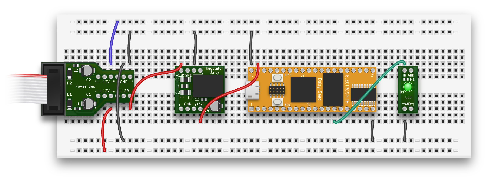

# led

## Description

This block is a simple monochromatic LED.
Its design is detailed [here](./documentation/design.md).


## Connecting

<p align="center"></p>

- This block needs its `GND` to be connected to the ground. All `GND` pins are connected
   internally.
- The signal `IN` is the LED signal. It should be connected to any GPIO of the
   target MCU, **preferably non-analog** GPIOs. See [Daisy Seed pinout](https://images.squarespace-cdn.com/content/v1/58d03fdc1b10e3bf442567b8/1591827747342-HCXMM2NNR26SP5F4U2CJ/ke17ZwdGBToddI8pDm48kN5PbQBGNYbW-5Hm1pf8hRF7gQa3H78H3Y0txjaiv_0fDoOvxcdMmMKkDsyUqMSsMWxHk725yiiHCCLfrh8O1z4YTzHvnKhyp6Da-NYroOW3ZGjoBKy3azqku80C789l0kLp48N9LluBiCpBrPZntaz462IffsVrAff3VJkwKncM1HZuDnV98dfxM9yHlqFkUQ/DaisyPinoutRev4%404x.png?format=500w) for details.


## Using

```c++
int main ()
{
   using namespace erb;
   
   Module module;
   Led led (module, Pin23);   // 1.
   
   module.run ([&](){
      led.on ();              // 2.
      led.off ();             // 3.
      led.pulse ();           // 4.
      led.blink ();           // 5.
   });
}
```

1. Attach the LED to the module and specify the same pin as the one used for connecting,
2. The LED is turned on,
3. The LED is turned off,
4. The LED is shorlty pulsed,
5. The LED is blinking.

The `Led` class reference is available [here](./documentation/reference.md).
