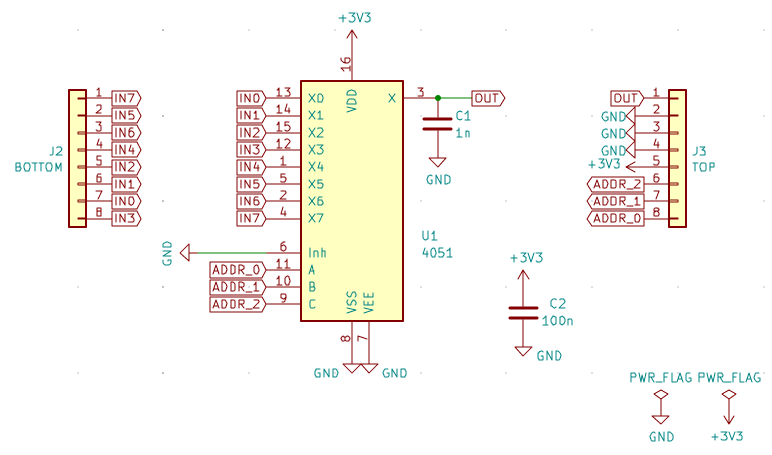

# Design

This design is adapted from the
[Mutable Instuments Tides schematics](https://mutable-instruments.net/modules/tides/downloads/tides_v40.pdf).

## Schematic

### Overview

This block allows to multiplex up to 8 3V3 value into a single value.

Reading a particular input is done by setting the address on the `CBA` pins.

Below is the `ADDR` to `IN#` relation table. Note that `C` is the most significant bit.

| IN# | ADDR (CBA) |
| - | - |
| IN0 | 000 |
| IN1 | 001 |
| IN2 | 010 |
| IN3 | 011 |
| IN4 | 100 |
| IN5 | 101 |
| IN6 | 110 |
| IN7 | 111 |

## PCB Layout

 

> Gerber renders made with [tracespace view](https://tracespace.io/view/).

The bypass capacitor `C2` is placed 1mm from `U1`.

## Generating Production Files

The gerber files and the BOM in `csv` format can be produced by running the block `build.py`
script. It requires to be launched with the Python KiCad bundled executable.
The files are generated in the `artifacts` block directory.

When using macOS and KiCad is installed in the usual `/Applications` directory, the
`build.py` script can be runned directly from the shell, as the shebang line will automatically
select the right version of Python to run.

## Implementation

When `Module::run` is called, all `Multiplexer` configurations are retrieved to configure the
ADC converter, as the convertion time of the ADC is quite long and wouldn't fit real-time
constraints. The convertion result is stored in an address the `Multiplexer` class is lazily monitoring.
