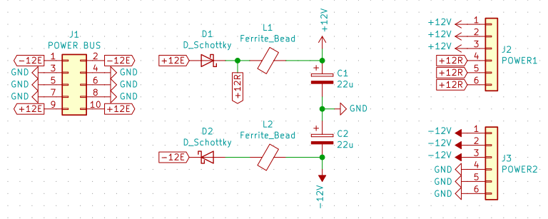

# Design

## Description

This block is a simple eurorack power bus connector adapter.

This design is adapted from the
[Mutable Instuments Tides schematics](https://mutable-instruments.net/modules/tides/downloads/tides_v40.pdf).

## Schematic

### Overview

This block provides a standard eurorack power bus connector.
It is protected against eurorack connector accidental polarity inversion:
- By providing a shrouded IDC header with a keying slot,
- By using Schottky diode.

### Polarity Inversion Protection

The input is a IDC male header. Both eurorack +12V and –12V lines goes first
through the Schottky diode `D1` and `D2`.

When polarity is inversed, the diodes can handle easily the 12V reverse voltage, as
their Peak Repetitive Reverse Voltage of 40V is way above as seen on its
[1N5819HW datasheet](https://www.diodes.com/assets/Datasheets/ds30217.pdf) on page 2.

### Eurorack System Noise Suppression

After polarity inversion protection, each line goes through a ferrite bead to suppress
high-frequency electronic noise coming from the Eurorack system itself, most likely
from other modules.

Without noise, the DC resistance of the ferrite bead is 600mΩ as seen on
page 1 of its [datasheet](https://www.we-online.de/katalog/datasheet/742792664.pdf).

The maximum impedance is reached between 80MHz to 500MHz with a 1kΩ peak at
around 100MHz, making a low-pass filter. Those frequencies are typically the ones found
in Eurorack digital modules.

### Bulk Capacitor

The `+12V` and `-12V` lines used for op-amps have bulk capacitors of 22µF which could
handle at least 10 op-amps easily.

### `+12R` Output

The rectified but not ferrite bead filtered 12V is available for power regulators, and to
make sure the digital switching noise wouldn't disturb the audio analog part of the circuit.

## PCB Layout

 

> Gerber renders made with [tracespace view](https://tracespace.io/view/).

## BOM

### Maximum Capacitors Rated Voltage

| Reference | Value | Rated Voltage |
| - | - | - |
| `C1` | 22µF | 35V |
| `C2` | 22µF | 35V |

Both capacitors see at most 12V, which is less than the half of their 35V rated voltage.

## Generating Production Files

The gerber files and the BOM in `csv` format can be produced by running the block `build.py`
script. It requires to be launched with the Python KiCad bundled executable.
The files are generated in the `artifacts` block directory.

When using macOS and KiCad is installed in the usual `/Applications` directory, the
`build.py` script can be runned directly from the shell, as the shebang line will automatically
select the right version of Python to run.
