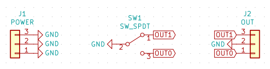

# Design

This design is adapted from the [Mutable Instuments Tides button schematics](https://mutable-instruments.net/modules/tides/downloads/tides_v40.pdf) and
adapted to a 3-position switch.

## Schematic

This block provides a switch compatible with
[SPDT](https://en.wikipedia.org/wiki/Switch#Contact_terminology) On-On or On-Off-On.

### Input

When position `OUT0` is not selected, it is floating. When `OUT0` is selected, it goes to ground.
The same concept is used for `OUT1`.

The Daisy Seed has a total of 31 GPIOs, only 12 of which are analog, so it is better to use
a non-analog GPIO to leave room for blocks which require an analog GPIO, such as
`cv-in` or `pot`.

### Position inversion

When the switch is on the left position, pin 2 and 3 are connected, the opposite happens
for the right position. This is why the traces are crossed on the PCB.

This decision was taken so that the output corresponding to the left position appears on
the left of the PCB, to avoid confusion when protoyping. The same remarks applies for
the right output.

### Software Implementation Considerations

When position `OUT0` is not selected, it needs to be seen as 3V3 by the GPIO pin. Thefore
the pin needs to be configured in pull-up mode. The same consideration applies for `OUT1`.

Because the signals `OUT0` and `OUT1` are inverted, they need to be inverted in software.

The `Switch` class takes care of all those constraints automatically.

## PCB Layout

 

> Gerber renders made with [tracespace view](https://tracespace.io/view/).

## Generating Production Files

The gerber files and the BOM in `csv` format can be produced by running the block `build.py`
script. It requires to be launched with the Python KiCad bundled executable.
The files are generated in the `artifacts` block directory.

When using macOS and KiCad is installed in the usual `/Applications` directory, the
`build.py` script can be runned directly from the shell, as the shebang line will automatically
select the right version of Python to run.

## Implementation

The switch will bounce when moving from one position to another. The signal as seen by the GPIO
looks like the following oscilloscope capture.

> Oscilloscope capture
> [by Max Maxfield for EE Journal](https://www.eejournal.com/article/ultimate-guide-to-switch-debounce-part-1/).

The signal needs to be "debounced", and a sliding window debounce algorithm was
implemented. It is adapted from the
[Mutable Instruments Tides switch driver](https://github.com/pichenettes/eurorack/blob/master/tides2/drivers/switches.cc#L66).
