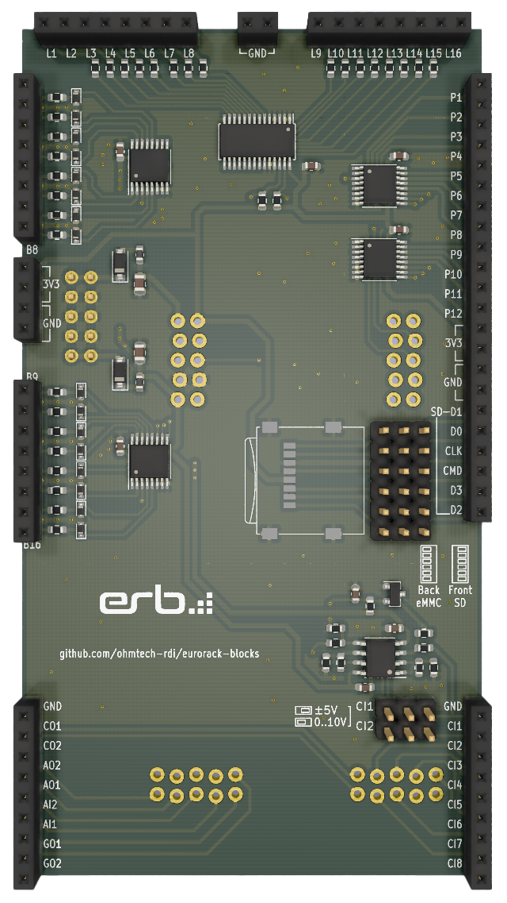

# Kivu12

`kivu12` is a board used for 12HP modules.

## Overview

The 12HP `kivu12` board is designed to host, at the bottom of the module,
12 standard Eurorack 3.5mm jacks  connectors, and/or trimmer potentiometers typically used
to represent attenuverters, distributed into 3 rows.

The rest of the module UI then goes at the top. The pin headers layout on the left and right side
don't allow to place small UI controls too close to the border. The pin header on the top doesn't
allow to place jack connectors, as it is typically done in sequencer modules.

All it's CV inputs are made for common CV levels, but for pitch or ADSR, it is possible to
adapt those to their specific Eurorack levels (0 to 10V and 0 to 8V respectively).
2 jumpers allow to select which mode to use for the first two CV inputs.

The board also provides a miniSD card slot to emulate an
[eMMC](https://en.wikipedia.org/wiki/MultiMediaCard#eMMC), typically used to store
factory samples. The miniSD format allows however to easily remove the miniSD card to change
its content conveniently on your computer with a simple miniSD card reader.

One can also put a miniSD card slot on the front of the module. A set of jumpers select which
miniSD connector (front board or back board) is used.

Finally, some predefined user interface design [templates](#templates) are provided below.

## Specifications

The Board provide the following features:

- 12 HP,
- 12 Pots/Trims/Sliders `P1..P12`,
- 16 Led pins `L1..L16`,
- miniSD or "emulated eMMC" selectable with jumpers:
   - Either a regular front panel miniSD card connector,
   - Or a miniSD card connector on the back board, acting as if it was a eMMC, but easier to reprogram
- 16 Buttons/Gates In/Switches pins `B1..B16`,
- 2 Gate Out `GO1..GO2`,
- 8 CV In `CI1..CI8`:
   - Either with ±5V levels,
   - Or 2 (CI1 and CI2) with optional 0..10V levels, selectable with a jumper, to support CV Pitch and ADSR
- 2 CV Out ±5V `CO1..CO2`,
- 2 Audio In ±5V `AI1..AI2`,
- 2 Audio Out ±5V `AO1..AO2`.

> Gerber renders made with [tracespace view](https://tracespace.io/view/).

## Templates

The following templates are available:

By default, [`auria`](./templates/auria.erbui) has 4 CV inputs, 2 Audio In, 2 Audio out, 4 attenuverters and 4 knobs.
