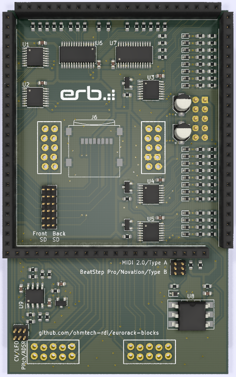
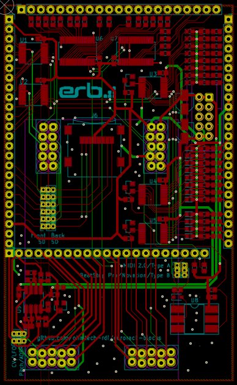
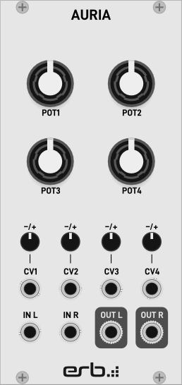

# Kivu12

`kivu12` is a board used for 12HP modules.

## Overview

The 12HP `kivu12` board is designed to host, at the bottom of the module, 12 standard Eurorack 3.5mm jacks 
connectors, and/or trimmer potentiometers typically used to represent attenuverters,
distributed into 3 rows. 

The rest of the module UI then goes at the top. The pin headers layout on the left and right side
don't allow to place small UI controls too close to the border. The pin header on the top doesn't
allow to place connectors like typically used in sequencers.

Some predefined [template](#templates) designs are available below.

## Specifications

The Board provide the following features:

- 12 HP,
- Up to 12 Pots/Trims/Sliders `P1..P12`,
- Up to 20 Led pins `L1..L20`,
- SD or "emulated MMC" selectable with jumpers:
   - Either a regular front panel SD card connector,
   - Or a SD card connector on the back board, acting as if it was a MMC, but easier to reprogram
- Up to 20 Buttons/Gates In/Switches pins `B1..L20`,
- 1 MIDI In  `MIR` (ring) `MIT` (tip), with TRS Type A or B selectable with jumpers,
- 1 MIDI Out   `MOR` (ting) `MOT` (tip),
- 2 Gate Out `GO1..GO2`,
- 8 CV In `CI1..CI8`:
   - Either with ±5V levels,
   - Or 2 (CI1 and CI2) with optional 0..10V levels, selectable with a jumper, to support CV Pitch and ADSR
- 2 CV Out ±5V `CO1..CO2`,
- 2 Audio In ±5V `AI1..AI2`,
- 2 Audio Out ±5V `AO1..AO2`.

## Templates

The following templates are available:

By default, [`auria`](./templates/auria.erbui) has 4 CV inputs, 2 Audio In, 2 Audio out, 4 attenuverters and 4 knobs.
