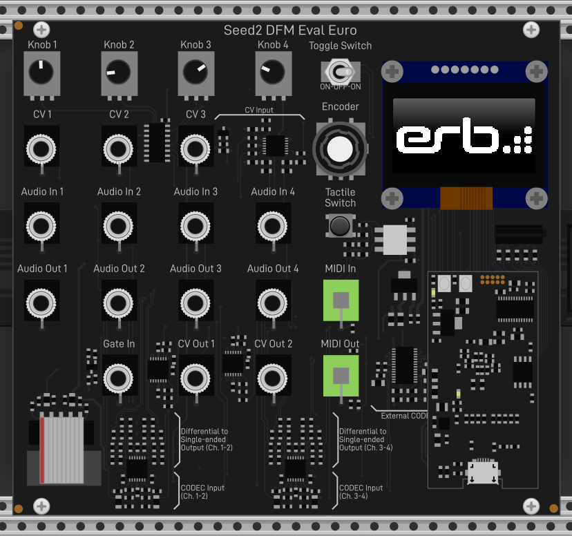
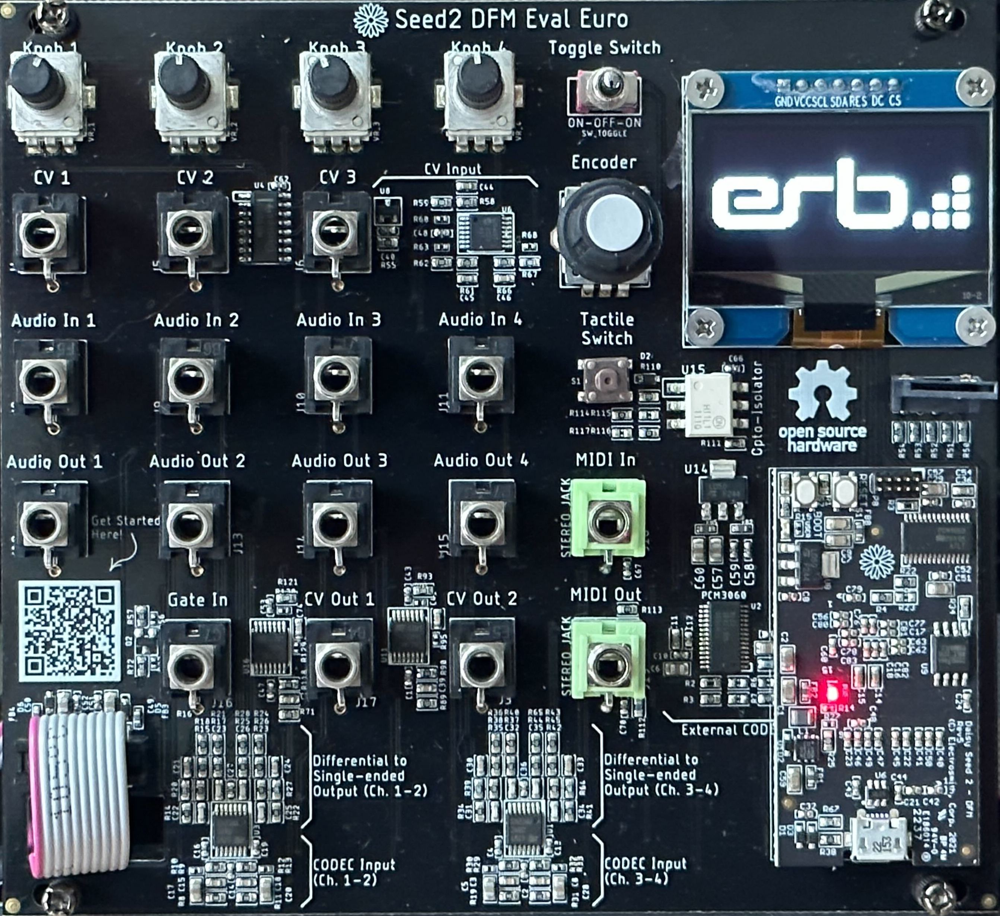

# Seed2 DFM Eval Euro

`seed2-dfm-eval-euro` is a board used to demonstrate the Eurorack-blocks
capabilities when using the Daisy Seed2 DFM daughter board.

## Overview

 

The Seed2 DFM Eval Euro is an evaluation board for the Seed2 DFM from Electro-smith.
The evaluation board contains all sort of standard circuitry to get developers
started quickly.

The implementation of this board with Eurorack-blocks is a typical example on
how to setup your custom board when using the Daisy Seed2 DFM daughter board.

> Thanks Electro-smith for supplying the Seed2 DFM Eurorack eval board to the project!  
