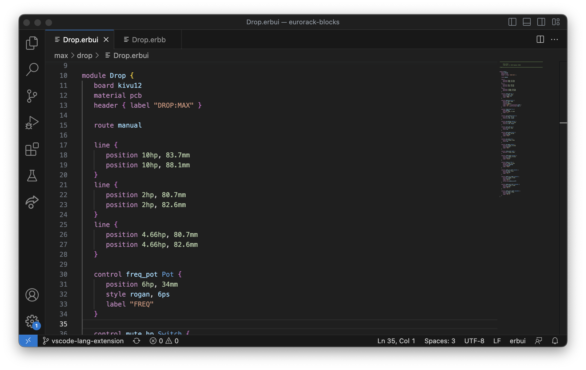
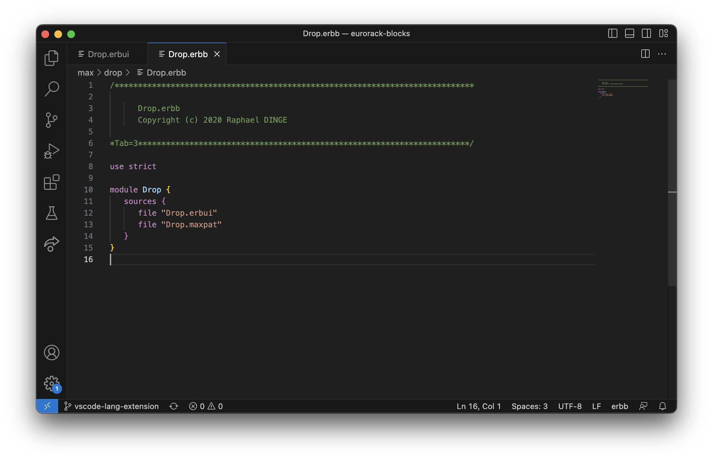

# eurorack-blocks-vscode

A Visual Studio Code extension for `eurorack-blocks` languages.

Eurorack-blocks allows doing software to Hardware prototyping for Eurorack using C++, Max/Gen~ or Faust. For more informations, please visit the [eurorack-blocks](https://github.com/ohmtech-rdi/eurorack-blocks) repository.

## Features

- Provides syntax highlighting of `.erbui` and `.erbb` files.
