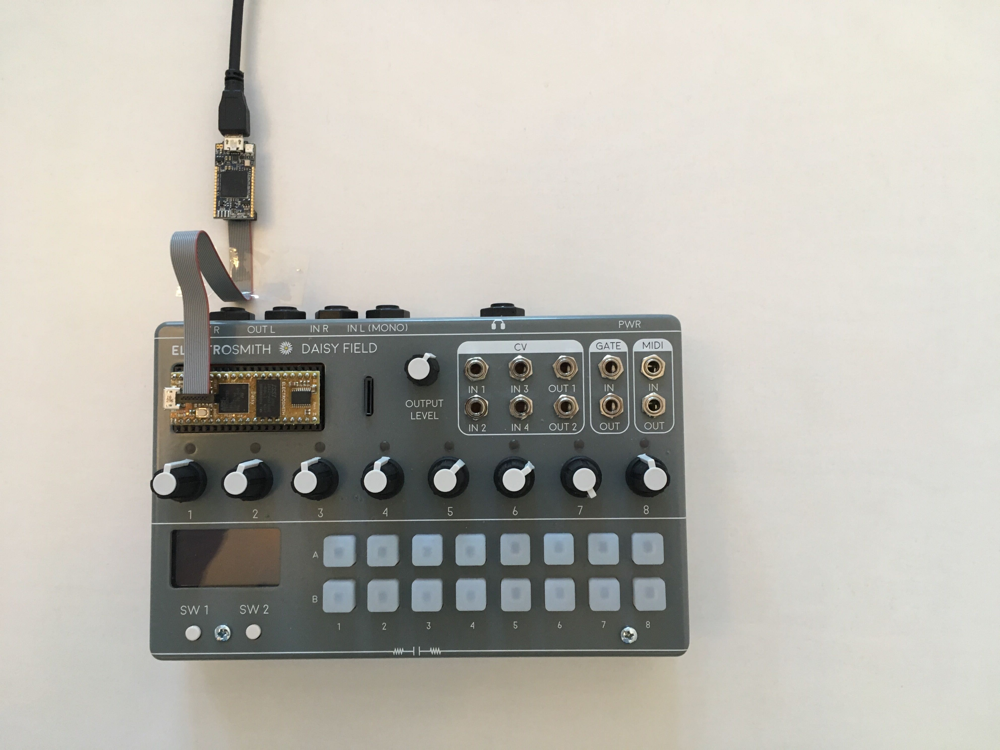
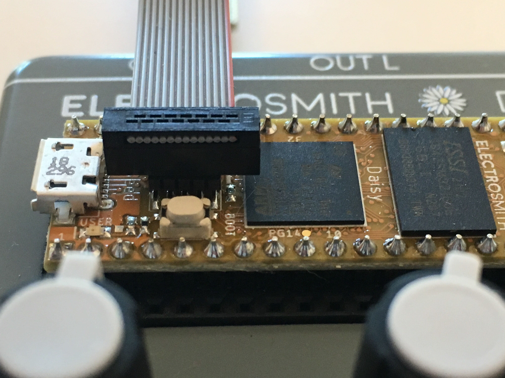
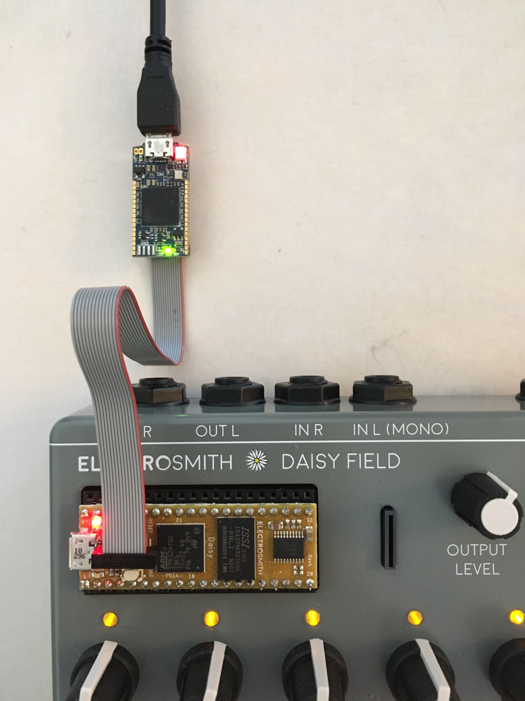

# Programming using STLink

## Overview

The [`STLINK-V3MINI`](https://www.st.com/content/st_com/en/products/development-tools/hardware-development-tools/hardware-development-tools-for-stm32/stlink-v3mini.html)
is a stand-alone debugging and programming mini probe for STM32
microcontrollers. The JTAG/SWD interfaces are used to communicate with the STM32
microcontroller located on the boards.

Using a programming probe has convenient advantages over using the USB programming
port:
- It doesn't require to press `BOOT`/`RESET` to upload a new firmware, which is convenient
   when testing your module in a full modular system,
- It is a bit faster than programming the board with the USB port.


## Installing

This project uses [openocd](http://openocd.org) to manage the STLink interface. A minimum
version of 0.11.0 is required in order to have native STM32 H7 support.

### macOS

```
brew install openocd
```

### Debian/Ubuntu

```
sudo apt-get install openocd
```


## Connecting

The ribbon cable connector must align exactly on the middle of the JTAG header. There
shall be 2 non-connected pins on each side of the header.



## Using



When the probe is connected to the computer with a USB cable, it should have two active
LEDs, one green, one red.

The `deploy.py` script in sample and test projects automatically detect the installation of
`openocd`, and if present, then rely on the probe being present as well.

While uploading the initially red LED will blink from greed to red until the process is finished.

Running the deploy command will output something similar to the following:

```console
raf:field$ ./deploy.py
Open On-Chip Debugger 0.11.0
Licensed under GNU GPL v2
For bug reports, read
   http://openocd.org/doc/doxygen/bugs.html
Info : auto-selecting first available session transport "hla_swd". To override use 'transport select <transport>'.
Info : The selected transport took over low-level target control. The results might differ compared to plain JTAG/SWD
Info : clock speed 1800 kHz
Info : STLINK V3J3M2 (API v3) VID:PID 0483:374E
Info : Target voltage: 3.186676
Info : stm32h7x.cpu0: hardware has 8 breakpoints, 4 watchpoints
Info : starting gdb server for stm32h7x.cpu0 on 3333
Info : Listening on port 3333 for gdb connections
target halted due to debug-request, current mode: Thread 
xPSR: 0x01000000 pc: 0x08002270 msp: 0x20020000
Info : Unable to match requested speed 4000 kHz, using 3300 kHz
Info : Unable to match requested speed 4000 kHz, using 3300 kHz
** Programming Started **
Info : Device: STM32H74x/75x
Info : flash size probed value 128
Info : STM32H7 flash has a single bank
Info : Bank (0) size is 128 kb, base address is 0x08000000
Warn : Adding extra erase range, 0x0800e440 .. 0x0801ffff
** Programming Finished **
** Verify Started **
** Verified OK **
** Resetting Target **
shutdown command invoked
raf:field$
```
