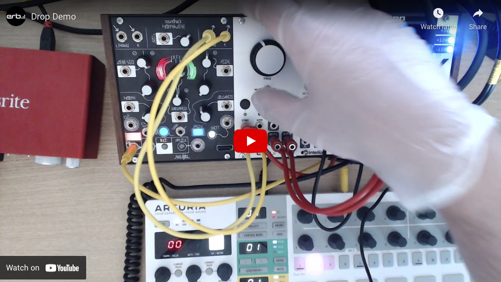

# Drop

[`Drop`](https://github.com/ohmtech-rdi/eurorack-blocks/tree/main/samples/drop)
is a sample to illustrate a simple module, yet using quite a lot of different Eurorack blocks controls,
like buttons, trim pots, gate inputs, LED with one or more colors.

[It is part of the Programming Guides and it can be found on **Read the Docs**](https://eurorack-blocks.readthedocs.io/en/latest/guides/drop.html)
