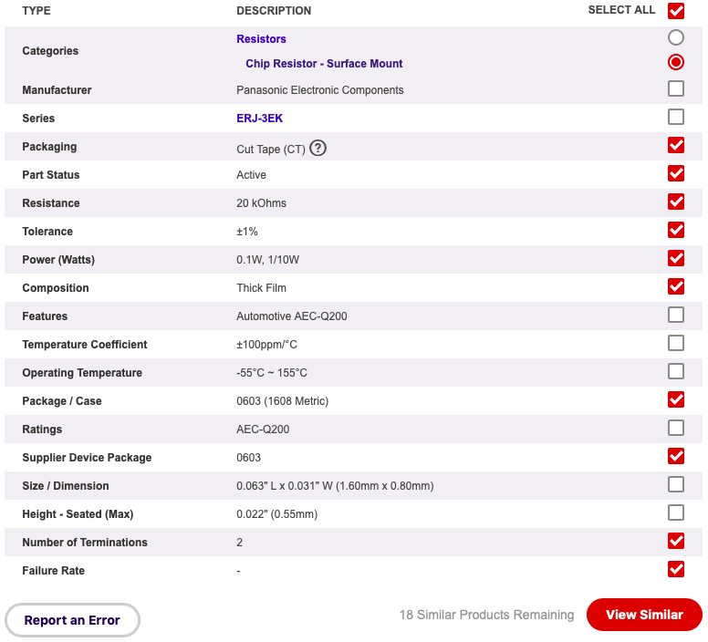
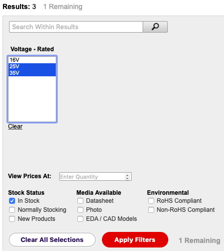

# util

This directory contains utility scripts.

## `replace-bom-parts.py`

This script automates the process of replacing a missing component part by another one.

There might be multiple causes of missing components:
- The distributor stock is empty, and the leading time (the time for the manufacturer to produce
   that component) is too high for it to solve naturally,
- The manufacturer has a production incident and cannot supply demand,
- The demand is especially big for a particular component and induce a global shortage,
- The component became obsolete.

This script, in combination with this documentation, will explain how to overcome this
situation in details, as it can happen quite often.

### Process

The distributor might provide alternatives, but those alternatives might not be suitable. For
example, it is quite common for the distributor to suggest to buy a reel, 5000 components,
usually, when a few only are needed.

To search for an alternative part on the DigiKey distributor:
- Using the `csv` BOM file, go the component link, go to the component page,
- alternatively, if using the BOM uploader, click on the "Part Number".

Go the "Product Attributes" section to search for similar parts. First "Select All" attributes,
and then **deselect**:
- *Manufacturer*
- *Series*
- *Automotive* feature if any,
- *Operating Temperature* if any, **but don't deselect the Temperature Coefficient**
- *AEC-Q200* rating if any,
- *Size*, as long as the package is standard,
- *Height* or *Thickness* if any

In all case make sure that *Packaging* is not reel or DigiReel, the *Part Status* is "Active",
the component value, *Rated* value and *Tolerance*, *Package/Case*,
*Temperature Coefficient* if any, *Features* if not "Automotive", *Mounting Type* if any,
 are the same.

See screenshot below for a typical part search. Note that the "Similar Products Remaining"
next to the "View Similar" button is more than 1.

<p align="center"></p>

Click on "View Similar" and select the first item on the top of the list. Keep the component
page open and move to the [Replacing](#replacing) section below.

If the "Similar Products Remaining" number next to the "View Similar" button is 1, proceed
to the next section.

### Exchange

When a global shortage of a component occurs, exactly similar components won't be
available. In that case follow the following process.

We are going to select components which attributes are better than the one initially
chosen. In all case, refer to the possible values as exposed in each block design.

Do the same process on the "Product Attributes" as previously, but deselect more options
if present:
- *Tolerance*,
- *Voltage - Rated*,
- *Power (Watts)*,
- *Applications*,
- *Part status* (in the worst case).

Make sure to keep the same *Package/Case* unless you want to rework all PCB layouts.

See screenshot below for a typical part search. Note that the "Similar Products Remaining"
next to the "View Similar" button is more than 1.

<p align="center"></p>

Then select, if present:
- A set of **lower** *Tolerance*,
- A set of **higher** *Voltage - Rated*,
- A set of **higher** *Power (Watts)*,
- Include *Part status* that are "Not recommended for new designs" or even "Obsolete" in
   the worst case (if there is stock),
- Click on the "In stock" check mark,

Finally click on "Apply Filter" and select the first item on the top of the list.
Keep the component page open and move to the [Replacing](#replacing) section below.

See screenshot below for a typical part search. Note that the "Similar Products Remaining"
next to the "View Similar" button is at least 1.

<p align="center"></p>

If the "Similar Products Remaining" number next to the "View Similar" button is 1, or the
search leads "0 Remaning" next to the "Apply Filters" button,
please add an [issue](https://github.com/ohmtech-rdi/eurorack-blocks/issues).

### Replacing

When a replacement component is found, the `replace-bom-parts.py` allows to replace
this part with the unavailable part in all designs of the repository, automatically.

Create an empty python file, here for example `replacement-data.py` and fill it with
the data as available on the component's distributor page:
- *Digi-Key Part Number* in `DistPartNumber`,
- *Description* (and **not** "Detailed Description") in `Description`,
- The URL of the page in the browser in `DistLink`.

Fill it in the file, here for example for this [component](https://www.digikey.de/product-detail/en/yageo/RC0603FR-0720KL/311-20-0KHRCT-ND/729987)
as a replacement of the [original component](https://www.digikey.de/product-detail/en/panasonic-electronic-components/ERJ-3EKF2002V/P20.0KHCT-ND/198237):

```
{
   'OriginalDistPartNumber': 'P20.0KHCT-ND',
   'Replacement': {
      'DistPartNumber': '311-20.0KHRCT-ND',
      'Description': 'RES SMD 20K OHM 1% 1/10W 0603',
      'DistLink': 'https://www.digikey.de/product-detail/en/yageo/RC0603FR-0720KL/311-20-0KHRCT-ND/729987',
   }
}
```

Then call the `replace-bom-parts.py` with that  `replacement-data.py` file, assuming
the current directory is `util`:

```
$ ./replace-bom-parts.py path/to/replacement-data.py
```

This will change automatically all the designs with the new component part.
Then run the block or kits `build.py` script and follow the order procedure to make sure
the replacement was done properly.

The script has a quite direct simple and not very robust algorithm.
Give a last check by making sure that the `git` diff looks appropriate for the change.

Please only make a pull request if and only if the component you replaced had a *Part Status*
marked as "Obsolete".
